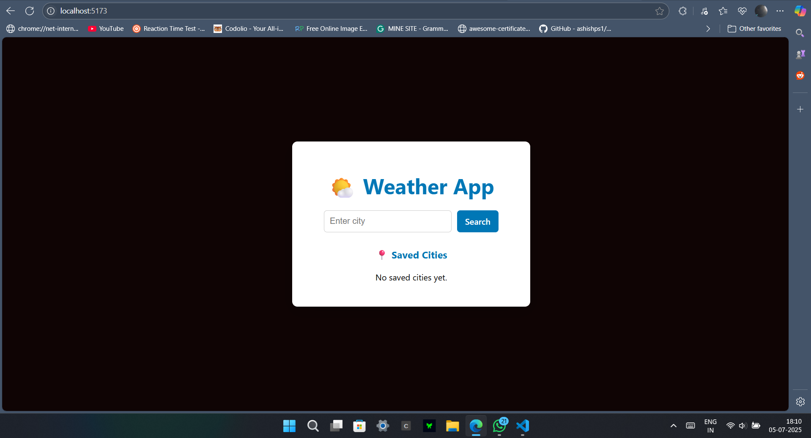
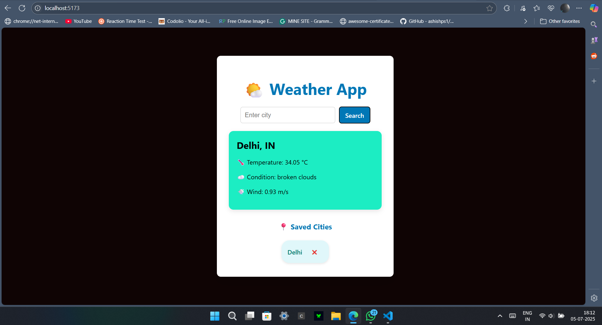
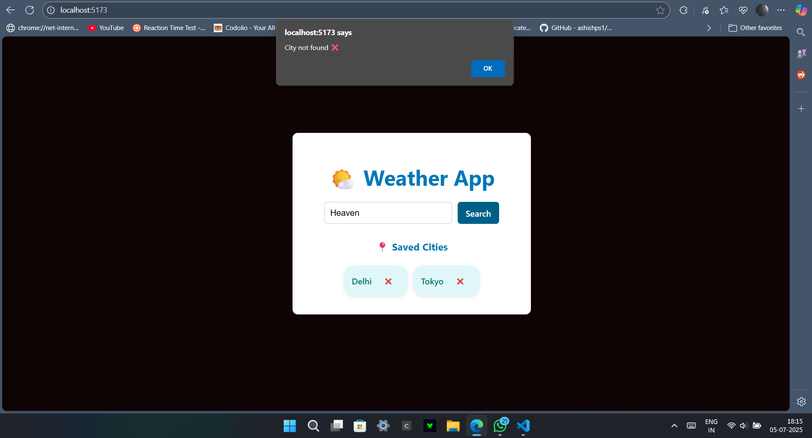

# 🌦️ Weather App

## 🎯 Objective
To build a responsive and user-friendly weather forecasting application that allows users to check real-time weather conditions of any city using a public API.

---

## 📄 Project Description
This Weather App is a single-page application (SPA) built with **React.js** and **Vite**. The goal was to learn API integration, React component structure, and dynamic UI updates based on external data. The app fetches live weather data from the **OpenWeatherMap API** and displays key weather information including:

- 🌡️ Temperature  
- 💧 Humidity  
- 🌥️ Weather condition  
- 🌬️ Wind speed

---

## 🔗 GitHub Repository
👉 [GitHub Link](https://github.com/Prabhu-21/weather-app)

---

## 🌐 Live Demo
🚧 _Not deployed yet_

---

📽️ Watch the Demo Video on YouTube
https://youtu.be/Hh1LuD08AC0  

---
## 📸 Screenshots

### 🏠 Homepage


### 🔍 City Search


### ❌ Error State


---

## 🛠️ Technologies Used

- ⚛️ React.js (with Vite)
- 📦 Axios (for HTTP requests)
- 🎨 HTML5 & CSS3
- 🌐 OpenWeatherMap API

---

## ⚙️ Setup Instructions

### Clone the Repo
```bash
git clone https://github.com/Prabhu-21/weather-app.git
cd weather-app

---

Install Dependencies
bash
Copy
Edit
npm install

---

🔐 Create a `.env` file in the root and refer to the `.env.example` for format.

---

Run the App
bash
Copy
Edit
npm run dev

---

🧠 Challenges Faced
-🔐 API Key Security
Initially pushed .env with a real key — quickly revoked the key and updated .gitignore to prevent this again.

-📱 Responsive Design
Adjusted layout for better viewing across different screen sizes.

-❌ Error Handling
Handled cases like invalid city names and missing API responses.

---

🧪 Test Credentials
Not applicable – no authentication used.
